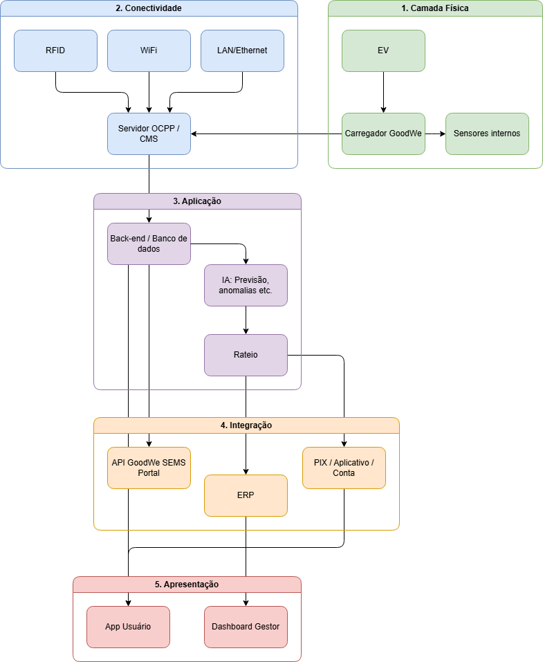

# Equipe
- Enzo Miguel de Oliveira Silva - rm571639
- Gabriel da Silva Amaral - rm570421
- Giovanni Dutra Dias - rm572671
- Pedro Aulicino Corrêa Coelho - rm570804
- Pedro Henrique Benício Santana Braga - rm572066

---

# Introdução ao Desafio
A rápida expansão dos veículos elétricos já coloca pressão sobre condomínios, prédios corporativos e campus universitários, que ainda não possuem infraestrutura de recarga preparada para lidar com a nova demanda. Sem mecanismos integrados, faltam soluções para organizar sessões por usuário, calcular consumo individual e aplicar regras de rateio justas. Diante desse cenário, surge uma oportunidade estratégica: transformar cada sessão de recarga em dados estruturados, em um modelo de rateio inteligente e em insights acionáveis, criando experiência digital transparente para todos os envolvidos.

---

# Frente 1 – CONTEXTO E PROBLEMA
- **Opção C**: Análise de dados públicos sobre crescimento da frota, infraestrutura de recarga e perfis de uso.

## O que são Infraestruturas de Recarga Compartilhada?
Infraestruturas de recarga compartilhada são sistemas de carregamento de veículos elétricos (VEs) projetados para atender múltiplos usuários.  

- Permitem que diferentes motoristas utilizem o mesmo carregador.  
- Individualizam o consumo de energia.  
- Facilitam o pagamento automatizado via aplicativos ou plataformas de gestão.  

### Categorias de Uso
- **Condomínios e edifícios residenciais**  
  - Vagas rotativas ou dedicadas.  
  - Consumo medido individualmente e cobrado via conta de luz ou aplicativo.  
  - Gestão Inteligente (Smart Charging) para equilibrar a carga entre veículos conectados.  

- **Espaços públicos e corporativos**  
  - Instalação em shoppings, estacionamentos, rodovias e vias públicas.  
  - Pagamento via cartão ou aplicativo.  
  - Equipamentos de alta potência, permitindo recarga em minutos.  

## Desafios Enfrentados
1. **Limitação da capacidade elétrica** – infraestrutura insuficiente para múltiplos veículos.  
2. **Rateio de custos e cobrança** – necessidade de medir consumo individual e distribuir custos de forma justa.  
3. **Logística e gestão de vagas** – controle para evitar conflitos e garantir disponibilidade.  
4. **Manutenção e atualização tecnológica** – manter equipamentos seguros e compatíveis com novas tecnologias.  

## Funcionamento Técnico e Captura de Dados
O processo de recarga segue protocolos globais (OCPP, IEC 61851, ISO 15118) e envolve cinco etapas:

1. **Conexão Física e Reconhecimento (Handshake)**  
   - Cabo plugado ao veículo.  
   - Circuito fechado pelo Control Pilot (CP).  
   - Definição da corrente máxima permitida.  

2. **Autenticação e Autorização**  
   - Usuário se identifica via RFID, QR Code ou Plug & Charge.  
   - Mensagem de validação enviada ao servidor em nuvem.  

3. **Início e Transmissão de Energia**  
   - Contatores internos acionados.  
   - Registro de dados iniciais: ID da sessão, usuário, horário e leitura do medidor.  

4. **Monitoramento e Telemetria (Tempo Real)**  
   - Pacotes de dados enviados periodicamente (MeterValues.req).  
   - Informações: potência (kW), corrente (A), tensão (V), temperatura e Estado de Carga (SoC).  

5. **Encerramento da Sessão**  
   - Fluxo interrompido ao atingir 100% ou por comando do usuário.  
   - Dados finais enviados (StopTransaction.req).  

### Captura de Dados
- **Via Nuvem (OCPP)** – modem 4G ou Wi-Fi envia dados para software de gestão (CMS).  
- **Via APIs de Integração** – dados consolidados integrados a ERP, sistemas condominiais ou BI.  
- **Via Rede Local (Modbus)** – leitura direta por CLP, sem internet externa.  

## Modelos de Negócio em Recarga Compartilhada
1. **Recarga Gratuita (Subsidiada)**  
   - Estabelecimento absorve custo da energia.  
   - Objetivo: atrair clientes e aumentar permanência.  
   - Tendência: em declínio global.  

2. **Cobrança por Energia (kWh)**  
   - Usuário paga apenas pela eletricidade consumida.  
   - Modelo justo e respaldado pela Resolução 1.000 da ANEEL.  

3. **Cobrança por Tempo (minuto)**  
   - Valor calculado pelo tempo de permanência.  
   - Ideal para rodovias, estimula rotatividade.  
   - Desvantagem: prejudica veículos com menor velocidade de carregamento.  

4. **Assinatura Mensal (Planos Fixos)**  
   - Mensalidade fixa para acesso ilimitado ou franquia de kWh.  
   - Foco: motoristas de aplicativo, frotas comerciais.  
   - Modelo consolidado nos EUA e Europa, em expansão no Brasil.  

5. **Rateio Condominial**  
   - Exclusivo para condomínios residenciais ou corporativos.  
   - Consumo individual medido e lançado no boleto do usuário.  
   - Isenta quem não possui veículo elétrico.  

## Análise de Mercado

O mercado brasileiro de **CMS (Charging Station Management Systems)** e **CPOs (Charge Point Operators)** apresenta diferentes soluções para desafios de limitação elétrica, faturamento e logística de vagas.

### Voltbras
- **Perfil**: Plataforma SaaS white-label para redes de eletropostos e frotas.  
- **Soluções**:  
  - Motor de cobrança automatizado com grupos tarifários.  
  - Integração com Smart Charging para balanceamento de carga.  
- **Estratégia**: Foco em software via OCPP, sem hardware próprio.  

### NeoCharge
- **Perfil**: Integradora de hardware (AC/DC) e software próprio.  
- **Soluções**:  
  - Monitoramento em tempo real de vagas.  
  - Relatórios de consumo individualizável.  
  - Projetos de infraestrutura elétrica.  

### Elev
- **Perfil**: Tecnologia em eletromobilidade para recarga urbana e frotas.  
- **Soluções**:  
  - Mitigação de ociosidade de vagas com notificações e tarifas excedentes.  
  - Carteira digital integrada (Pix, cartão de crédito).  
- **Estratégia**: Foco na jornada digital do motorista e simplificação de microtransações.  

## Crescimento do Setor

O mercado brasileiro de veículos eletrificados vem apresentando forte crescimento nos últimos anos.  

- Em **2025**, foram vendidos aproximadamente **224 mil veículos eletrificados**, representando um crescimento de **26%** em relação ao ano anterior.  
- A frota nacional ultrapassou **480 mil unidades** em meados de 2025, registrando crescimento de cerca de **28% em apenas seis meses**.  
- As categorias que mais cresceram foram os **veículos 100% elétricos (BEV)** e os **híbridos plug-in (PHEV)**.  

### Vendas por Região (2025)
1. **Sudeste**: 103.964 (46,4%)  
2. **Sul**: 40.085 (17,9%)  
3. **Nordeste**: 36.596 (16,3%)  
4. **Centro-Oeste**: 33.964 (15,2%)  
5. **Norte**: 9.303 (4,2%)  

### Vendas por Estado (2025)
1. **São Paulo**: 68.618 (30,6%)  
2. **Distrito Federal**: 21.639 (9,7%)  
3. **Minas Gerais**: 15.155 (6,8%)  
4. **Rio de Janeiro**: 14.280 (6,4%)  
5. **Paraná**: 14.024 (6,3%)  

### Vendas por Município (2025)
1. **São Paulo**: 28.212 (12,6%)  
2. **Brasília**: 21.639 (9,7%)  
3. **Belo Horizonte**: 9.372 (4,2%)  
4. **Rio de Janeiro**: 8.349 (3,7%)  
5. **Curitiba**: 6.488 (2,9%)  

## Distribuição de Pontos de Recarga

- O Brasil possui **21.061 pontos públicos e semipúblicos** de recarga de veículos elétricos (fev/2026).  
- Em um ano, a **recarga rápida (DC)** cresceu **167%**, representando **31% da rede**.  
- O número total de eletropostos cresceu **42%** sobre fevereiro de 2025 (14.827) e **25%** sobre agosto de 2025 (16.880).  
- Relação veículos elétricos plug-in / eletropostos: **19,6/1** (meta ideal: 10/1).  

### Recarga Rápida
- **Fevereiro 2025**: 2.430 carregadores rápidos/ultrarrápidos (DC)  
- **Fevereiro 2026**: 6.479 carregadores rápidos/ultrarrápidos (DC)  
- **Crescimento**: 166,6%  

Carregadores lentos (AC):  
- **Fevereiro 2025**: 12.397  
- **Fevereiro 2026**: 14.582  
- **Crescimento**: 17,6%  

### Geografia da Infraestrutura
Em fevereiro de 2026, **1.649 municípios brasileiros** já tinham eletropostos disponíveis.  

| Região       | fev/25 | fev/26 | Evolução |
|--------------|--------|--------|----------|
| Norte        | 47     | 82     | 74,5%    |
| Nordeste     | 326    | 412    | 26,4%    |
| Centro-Oeste | 121    | 152    | 25,6%    |
| Sul          | 363    | 423    | 16,5%    |
| Sudeste      | 506    | 580    | 14,6%    |
| **Total**    | 1.363  | 1.649  | 20,9%    |

## Perfis de Uso

- Os **híbridos (PHEV)** representam parcela significativa das vendas, pois não dependem exclusivamente da rede de recarga.  
- Os **100% elétricos (BEV)** dependem diretamente da expansão da infraestrutura de recarga.  
- A maior concentração de veículos eletrificados está na **região Sudeste**, especialmente em **São Paulo**.  
- A maioria dos carregadores instalados é do tipo **AC (corrente alternada)**, utilizados em recargas de longa duração em residências, condomínios e locais de trabalho.  
- Isso sugere que os usuários tendem a carregar seus veículos durante períodos prolongados de estacionamento, tornando essencial o uso de **sistemas de monitoramento, controle de acesso e gestão compartilhada da infraestrutura**.  

## Conclusão

Infraestruturas de recarga compartilhada são essenciais para a expansão da mobilidade elétrica no Brasil. Elas enfrentam desafios técnicos e operacionais, mas contam com modelos de negócio diversificados e soluções tecnológicas que tornam a operação viável e escalável.  

O Brasil vive uma fase de **expansão acelerada da mobilidade elétrica**, com crescimento expressivo tanto nas vendas de veículos quanto na infraestrutura de recarga. A tendência aponta para maior interiorização da eletromobilidade, diversificação dos perfis de uso e consolidação de uma rede de recarga cada vez mais rápida e eficiente.

---

# Frente 2 - BASE REGULATÓRIA E TÉCNICA
- **Opção B**: Exploração da API GoodWe (SEMS Portal).

## Resolução Normativa ANEEL nº 1.000/2021
A Resolução Normativa nº 1.000, publicada pela Agência Nacional de Energia Elétrica (ANEEL) em dezembro de 2021, consolidou diversas normas relacionadas à prestação do serviço público de distribuição de energia elétrica.  

O principal objetivo da resolução foi reunir em um único documento os direitos e deveres dos consumidores e das distribuidoras de energia.

### Relevância para mobilidade elétrica
- Critérios para conexão de unidades consumidoras  
- Atendimento de solicitações de aumento de carga  
- Padrões de medição  
- Responsabilidades técnicas dos usuários conectados à rede elétrica  

No contexto da recarga de veículos elétricos, a instalação de carregadores pode resultar em aumento da demanda energética da unidade consumidora.  
Devem ser observadas as condições de fornecimento estabelecidas pela distribuidora local, bem como os requisitos técnicos previstos pela regulamentação vigente.

A resolução também possui relação indireta com sistemas de geração distribuída, frequentemente utilizados em conjunto com carregadores veiculares.

### Aplicação prática
A Resolução nº 1.000/2021 fornece a base regulatória necessária para a integração entre sistemas fotovoltaicos, carregadores de veículos elétricos e a rede de distribuição.  
Sua observância garante que a expansão da infraestrutura de recarga ocorra de forma compatível com as condições técnicas da concessionária e com a segurança do sistema elétrico.

## Carregador GoodWe HCA G2
O **GoodWe HCA G2** é um carregador de corrente alternada (AC) desenvolvido para aplicações residenciais e comerciais.  

Projetado para operar integrado ao ecossistema GoodWe, permite comunicação com sistemas fotovoltaicos, baterias e plataformas de monitoramento.

### Principais características
- Carregamento inteligente  
- Autenticação de usuários  
- Comunicação com sistemas externos por diferentes interfaces  

### Interfaces de comunicação
- **RS-485** → robustez e confiabilidade em sistemas industriais  
- **LAN** → integração via cabo Ethernet, maior estabilidade  
- **Wi-Fi** → conexão sem fio para monitoramento remoto e integração em nuvem  
- **Bluetooth** → usado na instalação e configuração inicial  
- **RFID** → autenticação de usuários por cartões/dispositivos compatíveis  

### Aplicação prática
A presença de múltiplas interfaces de comunicação permite que o HCA G2 seja integrado a diferentes cenários, desde instalações residenciais simples até sistemas corporativos com monitoramento centralizado e controle de acesso.

## API GoodWe (SEMS Portal)
A plataforma **SEMS Portal** é o sistema de monitoramento da GoodWe para usinas fotovoltaicas, baterias, inversores e dispositivos conectados.  

Por meio da API, é possível acessar informações operacionais e integrá-las a aplicações externas.

### Dados disponibilizados
- Usinas cadastradas  
- Dispositivos instalados  
- Geração de energia  
- Potência instantânea  
- Consumo energético  
- Baterias  
- Alarmes e eventos  
- Informações de comunicação  
- Dados históricos de operação  

### Exploração da API
Um fluxo típico de utilização envolve:
1. Autenticação da aplicação  
2. Identificação das usinas disponíveis  
3. Consulta dos dispositivos cadastrados  
4. Obtenção de dados operacionais  
5. Armazenamento dos dados em banco próprio  
6. Apresentação das informações ao usuário final  

### Possibilidades de utilização
- Monitoramento em tempo real da geração fotovoltaica  
- Acompanhamento do consumo energético  
- Análise de desempenho dos equipamentos  
- Geração automática de relatórios  
- Integração com sistemas de gestão energética  
- Apoio à tomada de decisão sobre recarga de veículos elétricos  

Em projetos de mobilidade elétrica, os dados da API podem ser usados para identificar períodos de maior geração solar e direcionar o carregamento dos veículos para esses horários.

## Conclusão
A combinação entre:
- Regulamentação da ANEEL  
- Recursos de comunicação do **GoodWe HCA G2**  
- Funcionalidades da **API SEMS Portal**  

Cria um ambiente favorável para soluções de mobilidade elétrica integradas à geração fotovoltaica.  

Essas tecnologias ampliam o monitoramento, controle e eficiência energética das instalações, contribuindo para o crescimento da infraestrutura de recarga e para a adoção de veículos elétricos no Brasil.

---

# Frente 3 - ARQUITETURA E IA
- **Opção B**: Definição do papel da Inteligência Artificial no fluxo de dados e no modelo de rateio.

A plataforma **EV ChargeOps** foi concebida para estruturar sessões de recarga de veículos elétricos em ambientes compartilhados, como condomínios e edifícios corporativos. Sua arquitetura é organizada em quatro camadas complementares: **física, conectividade, aplicação e apresentação**. Essa divisão permite compreender como os dados fluem desde o carregador até a fatura individual do usuário, garantindo interoperabilidade, segurança e transparência.

## 1. Camada Física (Hardware)

A camada física corresponde aos equipamentos responsáveis pela execução da recarga. Optou-se pela utilização exclusiva de **carregadores em corrente alternada (AC)**, por serem mais adequados ao perfil de uso em condomínios, onde os veículos permanecem estacionados por longos períodos.

Segundo a **ABVE (2026)**, em fevereiro de 2026, **69% dos pontos de recarga no Brasil eram AC**, predominando em residências e locais de trabalho, o que reforça a adequação dessa escolha.

Os carregadores AC são equipados com sensores internos que medem:
- Potência (kW)  
- Tensão (V)  
- Corrente (A)  
- Temperatura  
- Estado de carga (SoC) da bateria  

Esses dados são essenciais para garantir segurança elétrica e alimentar o modelo de rateio. A conformidade com normas como **ABNT NBR IEC 61851-21** (segurança e desempenho da recarga) e **ABNT NBR 17019** (instalações elétricas para veículos elétricos) assegura confiabilidade e regulamentação adequada.

## 2. Camada de Conectividade (Rede e Protocolos)

A camada de conectividade garante a comunicação entre carregadores, sistemas de gestão e usuários. Foram priorizadas redes de baixo custo e fácil integração em ambientes residenciais:
- **LAN (Ethernet)** → estabilidade  
- **Wi-Fi** → monitoramento remoto  
- **RFID** → autenticação prática dos moradores  

O protocolo **OCPP (Open Charge Point Protocol)** foi adotado como padrão de interoperabilidade, permitindo que diferentes fabricantes de carregadores se integrem ao sistema. Normas internacionais como **IEC 61851** e **ISO 15118** complementam a comunicação, possibilitando recursos como *plug & charge* e *smart charging*.

A **Resolução Normativa nº 1.000/2021 da ANEEL** reforça a obrigatoriedade de protocolos abertos em equipamentos de uso compartilhado, o que justifica a adoção de OCPP e IEC/ISO como base da camada de conectividade.

## 3. Camada de Aplicação (Back-end, Regras de Negócio e IA)

A camada de aplicação concentra o processamento dos dados e a lógica de negócio da plataforma. O **back-end** é responsável por receber os registros das sessões de recarga, armazená-los em banco de dados e aplicar regras de cobrança.

A **inteligência artificial (IA)** desempenha papel estratégico nessa camada:
- **Previsão de consumo**: algoritmos de regressão estimam a demanda futura de energia.  
- **Balanceamento de carga**: técnicas de *smart charging* distribuem a potência disponível entre múltiplos veículos conectados.  
- **Detecção de anomalias**: modelos de machine learning identificam falhas ou sessões irregulares.  

Essas funcionalidades garantem eficiência operacional e transparência no cálculo das faturas.

## 4. Camada de Apresentação (Interfaces do Gestor e Usuário)

A camada de apresentação disponibiliza os resultados para gestores e usuários finais:
- **Gestores**: dashboards com monitoramento em tempo real, relatórios de consumo, status das vagas e alertas de manutenção.  
- **Usuários**: aplicativo ou portal web com histórico de recargas, fatura individual, notificações de término de carga e opções de pagamento (Pix, cartão de crédito, carteira digital).  

Exemplos reais como **Elev** e **NeoCharge** já oferecem notificações de término de carga e relatórios individualizados, demonstrando a viabilidade dessa camada.

## Fluxo dos Dados até a Fatura

O fluxo de dados na plataforma EV ChargeOps descreve o caminho percorrido pelas informações desde o início da sessão de recarga até a emissão da fatura individual do usuário.

1. **Início da sessão**  
   - Veículo conectado ao carregador AC.  
   - Autenticação via RFID ou aplicativo.  
   - Registro inicial: ID da sessão, usuário, horário e leitura do medidor.  

2. **Coleta de dados em tempo real**  
   - Sensores capturam potência, corrente, tensão, temperatura e SoC.  
   - Dados enviados periodicamente via OCPP.  

3. **Transmissão e armazenamento**  
   - Informações transmitidas pela rede (LAN/Wi-Fi) ao CMS.  
   - Registros armazenados em banco de dados relacional.  

4. **Processamento pela IA**  
   - Regressão para padrões de consumo.  
   - *Smart charging* para balanceamento de carga.  
   - Detecção de anomalias em sessões.  

5. **Cálculo da fatura individual**  
   - Aplicação do modelo de rateio.  
   - Tratamento automático de casos excepcionais.  

6. **Integração e apresentação**  
   - Valores integrados ao ERP/condomínio.  
   - Usuário acessa fatura via app ou portal web.  

Plataformas como **Voltbras** e **NeoCharge** já estruturam fluxos semelhantes, emitindo relatórios individualizados e integrando dados diretamente em sistemas de gestão predial.

## Diagrama

## Modelo de Rateio Proposto

A equipe propõe um modelo híbrido de rateio, baseado no consumo real de energia (kWh) com acréscimo de taxa de manutenção proporcional.

### Variáveis consideradas
- Energia consumida (kWh)  
- Tarifa vigente da distribuidora local  
- Taxa de manutenção proporcional (custos fixos de infraestrutura)  

### Fórmula de cálculo
Fatura Individual = (kWh consumidos × tarifa) + taxa de manutenção

### Casos excepcionais
- **Sessão interrompida** → cobrança proporcional ao consumo registrado.  
- **Usuário sem recarga no mês** → não recebe cobrança.  
- **Dois veículos da mesma unidade** → consumo somado e lançado em uma única fatura.  

Esse modelo garante que cada usuário pague exatamente pelo que consumiu, evitando subsídios cruzados. Ao mesmo tempo, a taxa de manutenção cobre custos de operação e atualização tecnológica, assegurando a sustentabilidade da infraestrutura.

O modelo de **rateio condominial** já é utilizado pela **Elev**, que mede o consumo individual e lança o valor diretamente no boleto do usuário, isentando quem não possui veículo elétrico.

---

# Plano para a Sprint 2

---

# Fontes

- ASSOCIAÇÃO BRASILEIRA DO VEÍCULO ELÉTRICO. Recarga pública rápida cresce 167% em 12 meses e já atinge 31% dos 21 mil eletropostos da rede. São Paulo: ABVE, 2026. Disponível em: <https://abve.org.br/recarga-publica-rapida-cresce-167-em-12-meses-e-ja-atinge-31-dos-21-mil-eletropostos-da-rede/>. Acesso em: 17 jun. 2026.  

- ASSOCIAÇÃO BRASILEIRA DO VEÍCULO ELÉTRICO. Eletrificados crescem dez vezes mais do que conjunto do mercado em 2025, com 224 mil veículos vendidos. São Paulo: ABVE, 2026. Disponível em: <https://abve.org.br/eletrificados-crescem-dez-vezes-mais-do-que-conjunto-do-mercado-em-2025-com-224-mil-veiculos-vendidos/>. Acesso em: 17 jun. 2026.  

- ASSOCIAÇÃO BRASILEIRA DO VEÍCULO ELÉTRICO. Infraestrutura de recarga avança e já está em 25% dos municípios brasileiros. São Paulo: ABVE, 2026. Disponível em: <https://abve.org.br/infraestrutura-de-recarga-avanca-e-ja-esta-em-25-dos-municipios-brasileiros/>. Acesso em: 18 jun. 2026.  

- ASSOCIAÇÃO BRASILEIRA DE NORMAS TÉCNICAS. NBR IEC 61851-21: Veículos elétricos – requisitos de segurança e desempenho para sistemas de recarga condutiva. Rio de Janeiro: ABNT, 2019.  

- ASSOCIAÇÃO BRASILEIRA DE NORMAS TÉCNICAS. NBR 17019: Instalações elétricas para alimentação de veículos elétricos – requisitos. Rio de Janeiro: ABNT, 2020.  

- AGÊNCIA NACIONAL DE ENERGIA ELÉTRICA. Resolução Normativa nº 1.000, de 7 de dezembro de 2021. Brasília: ANEEL, 2021. Disponível em: <https://www.aneel.gov.br/atos-normativos>. Acesso em: 18 jun. 2026.  

- GOODWE TECHNOLOGIES CO., LTD. HCA G2 Series – EV Charger: Datasheet. Suzhou, China: GoodWe, 2024. Disponível em: GoodWe HCA G2 Datasheet.  

- GOODWE TECHNOLOGIES CO., LTD. Linha HCA G2 Carregador CA. São Paulo: GoodWe Brasil, 2026. Disponível em: GoodWe Brasil - HCA G2.  

- GOODWE TECHNOLOGIES CO., LTD. OpenAPI Developer Platform. Suzhou, China: GoodWe, 2026. Disponível em: <https://openapi.goodwe.com>.  

- GOODWE TECHNOLOGIES CO., LTD. API Introduction. Suzhou, China: GoodWe, 2022. Disponível em: <https://community.goodwe.com>.  

- GOODWE TECHNOLOGIES CO., LTD. GoodWe API Documentation. Suzhou, China: GoodWe, 2024. Disponível em: <https://community.goodwe.com>.  

- NEOCHARGE. Plataforma de Gestão de Recarga. São Paulo: NeoCharge, 2026. Disponível em: <https://www.neocharge.com.br>. Acesso em: 18 jun. 2026.  

- PLUGMAPPER EV CHARGING. Plug & Charge (ISO 15118) Explained: Set-and-Go EV Charging in 2025. 2025. Disponível em: <https://plugmapper.com/blog/plug-and-charge-iso-15118-explained-2025>. Acesso em: 17 jun. 2026.
